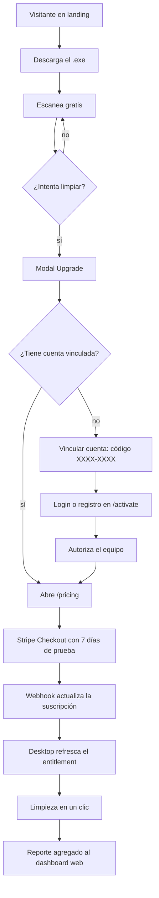
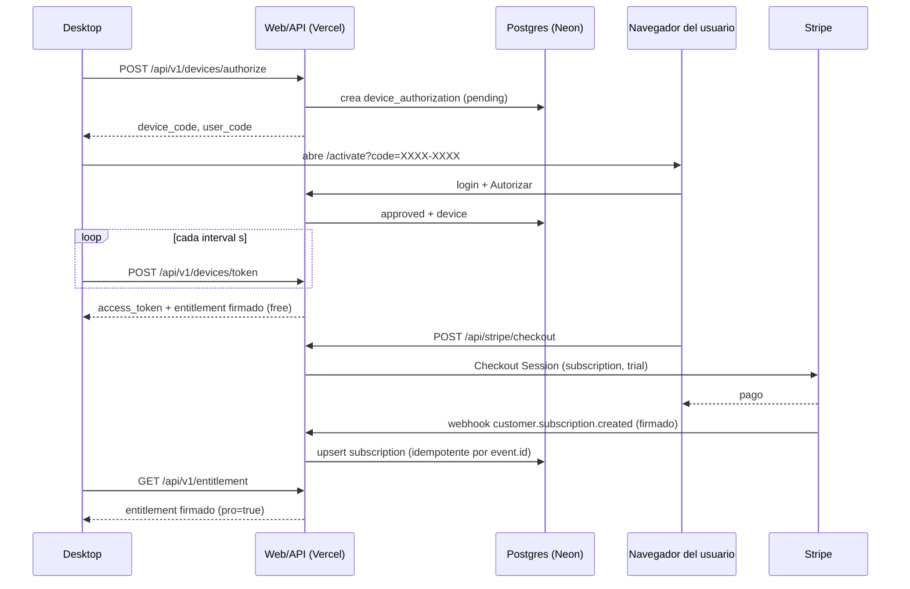
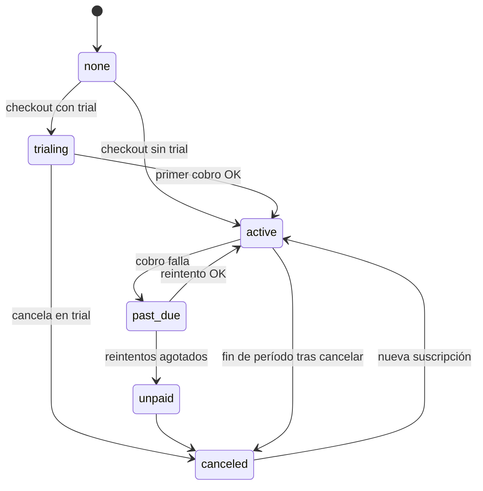
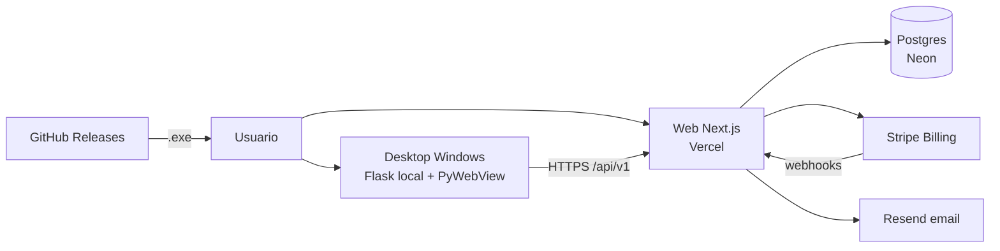
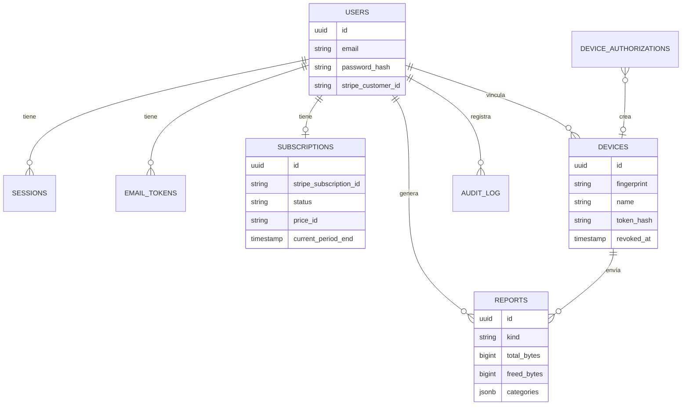
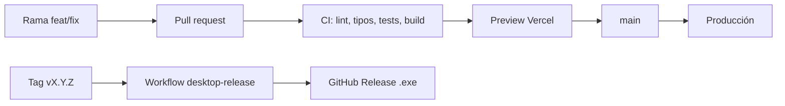

# BLUEPRINT — DiskScanner Turbo

> Fuente de verdad obligatoria. Ningún cambio de arquitectura, contrato, módulo, firma, infraestructura o umbral de calidad es válido hasta estar reflejado acá (con fecha). Decisiones costosas de revertir: ver `docs/adr/`. Contrato desktop↔web: `docs/CONTRATO-API.md`.
> Última actualización: 2026-10-05

## 1. Concepto general

- **Nombre:** DiskScanner Turbo.
- **Frase:** "Encontrá y liberá los GB que Windows esconde, en un clic y sin miedo a romper nada."
- **Problema:** los discos de usuarios de Windows (sobre todo desarrolladores y gamers) se llenan de cachés, dependencias viejas (`node_modules`, `venv`, Gradle), duplicados, instaladores de juegos olvidados y archivos "zombie". Las herramientas clásicas (WinDirStat, TreeSize) muestran el problema pero no lo resuelven, y los "limpiadores" masivos generan desconfianza.
- **Usuario concreto:** desarrollador o gamer con Windows 10/11 y SSD de 256 GB–1 TB que se quedó sin espacio; segundo segmento: usuarios avanzados que mantienen PCs de la familia.
- **Métrica de éxito:** MRR. Indicadores: conversión free → trial ≥ 5 %, trial → pago ≥ 40 %, churn mensual ≤ 6 %, GB liberados por usuario activo (se ve en el dashboard). `(propuesta a validar)`
- **Propuesta de valor:** escaneo gratis y rapidísimo; limpieza en un clic de ubicaciones conocidas como seguras (papelera de reciclaje por defecto); dashboard web con historial y GB liberados; privacidad: nunca se suben rutas ni nombres de archivo.
- **Modelo:** freemium. Gratis = escanear, visualizar, analizar, exportar informe. **Pro** (suscripción mensual o anual, prueba de 7 días) = todas las limpiezas, hasta 3 PCs, sincronización con el dashboard web.
- **Fuera de alcance (v2.0):** macOS/Linux como plataformas vendidas; limpieza remota disparada desde la web; planes de equipo/empresa con facturación centralizada; antivirus u optimización de registro; app móvil; programa de afiliados.

## 2. Análisis funcional

### 2.1 Actores y roles
| Actor | Descripción | Dónde se autentica |
|---|---|---|
| Visitante | Navega la landing, precios, descarga | — |
| Usuario free | Cuenta web sin suscripción; desktop en modo gratis | Sesión web (cookie) / token de dispositivo |
| Usuario Pro | Suscripción `trialing`, `active` o `past_due` | Ídem |
| Dispositivo | Instalación del desktop vinculada a una cuenta | `Bearer` + fingerprint |
| Stripe | Sistema de cobros, notifica por webhook | Firma `Stripe-Signature` |
| Operador | Dueño del producto; opera Stripe, Vercel, Neon | Paneles de cada plataforma (2FA) |

### 2.2 Casos de uso (verificables)
1. El visitante puede descargar el `.exe` desde `/download` sin crear cuenta.
2. El usuario sin cuenta puede escanear, analizar y exportar un informe en el desktop.
3. Al intentar una acción destructiva sin Pro, el desktop muestra el modal de upgrade (`pro_required`).
4. El usuario puede crear una cuenta con email y contraseña, verificar su email y recuperar la contraseña.
5. El usuario puede vincular el desktop a su cuenta con un código `XXXX-XXXX` aprobado en `/activate`.
6. El usuario puede iniciar una prueba de 7 días y suscribirse (mensual o anual) vía Stripe Checkout.
7. Tras el pago, el desktop desbloquea Pro en ≤ 60 s (polling de reintento) o al tocar "Ya me suscribí".
8. El usuario puede gestionar o cancelar su suscripción en el Customer Portal de Stripe.
9. El usuario Pro ve en `/dashboard` sus escaneos, limpiezas y GB liberados (últimos 30 días y total).
10. El usuario puede ver y revocar sus equipos; un equipo revocado vuelve a modo gratis en el próximo refresco.
11. El desktop sigue funcionando en Pro hasta 7 días sin conexión.
12. El usuario puede borrar su cuenta (cancela la suscripción y elimina sus datos).

### 2.3 Requisitos funcionales por área
- **Desktop:** escaneo por streaming (SSE), Smart Cleanup (análisis → ejecución), herramientas de limpieza puntuales, salud de disco, explorador con treemap, exportación; vinculación de cuenta; gating Pro; sincronización de resúmenes.
- **Web marketing:** landing, precios con FAQ, descarga, legales.
- **Cuenta:** registro, login, logout, verificación de email, reset de contraseña, cambio de contraseña, borrado de cuenta.
- **Billing:** checkout (mensual/anual, trial, códigos promocionales), portal, webhooks, estado de suscripción.
- **Dispositivos:** device flow, emisión de entitlement firmado, límite por plan, revocación.
- **Reportes:** ingesta de resúmenes agregados, dashboard con métricas.

### 2.4 Requisitos no funcionales (con número)
| Atributo | Objetivo | Cómo se mide |
|---|---|---|
| Performance web (marketing) | LCP < 2,5 s, INP < 200 ms, CLS < 0,1 (p75 móvil) | Vercel Speed Insights / Lighthouse |
| JS inicial por ruta marketing | < 170 KB gz | salida de `next build` |
| Latencia API `/api/v1/*` | p95 < 300 ms | logs JSON en Vercel |
| Disponibilidad web/API | 99,5 % mensual | monitor externo sobre `/api/v1/health` |
| Desbloqueo Pro post-pago | ≤ 60 s | prueba manual en checklist de lanzamiento |
| Operación offline desktop | 7 días con Pro vigente | test `test_offline_grace` |
| Privacidad | 0 rutas/nombres de archivo enviados | test de payload de reportes + revisión |
| Accesibilidad | WCAG 2.2 AA | axe + teclado manual |
| Recuperación | RPO ≤ 24 h, RTO ≤ 4 h | PITR de Neon + simulacro |

## 3. Flujogramas

### 3.1 Flujos críticos del usuario

### 3.2 Interacciones entre servicios

### 3.3 Ciclo de vida de la suscripción

`pro = status ∈ {trialing, active, past_due}` (past_due mantiene Pro durante los reintentos de Stripe).

## 4. Experiencia, marca y dirección de arte

### 4.1 Branding y design tokens
No hay manual de marca entregado. Tokens derivados del desktop existente (`desktop/static/style.css`) para que web y app se sientan un solo producto `(propuesta a validar)`:
- Fondos: `#0b0f17` (base), `#131926` (elevado), `#1a2233` (superficie).
- Texto: `#f1f5f9`, `#cbd5e1`, `#8b95a7`.
- Acción: azul `#3b82f6` (400 `#60a5fa`, 600 `#2563eb`); secundario violeta `#8b5cf6`.
- Semánticos: éxito `#10b981`, advertencia `#f59e0b`, peligro `#ef4444`.
- Radios 6/10/14/20 px; espaciado base 4 px; tipografía Inter (autohospedada vía `next/font`).
- Logo: monograma SVG disco + velocidad (`web/src/app/icon.svg`) `(propuesta a validar: reemplazar por logo profesional)`.

### 4.2 Design system
Web: tokens en `web/src/app/globals.css` (tema Tailwind v4); componentes base en `web/src/components/ui` (botón, input, card, badge, alert, modal). Estados obligatorios: carga (skeleton), vacío, error, éxito. Desktop: tokens en `desktop/static/style.css`.

### 4.3 Voz y microcopy
Producto y web en **inglés** `(propuesta a validar: agregar español)`. Tono directo, técnico y tranquilizador: cifras concretas ("12.4 GB found"), nunca alarmista. Las acciones destructivas dicen exactamente qué borran y si va a la papelera.

### 4.4 Capa de motion premium
No aplica: la venta se apoya en la demo del producto (mock de UI construido en código) y en la velocidad de carga; un fondo de video penalizaría el LCP sin aportar conversión en una herramienta utilitaria. Motion sutil, respetando `prefers-reduced-motion`.

## 5. Arquitectura general

### 5.1 Estilo y justificación
Monorepo con dos aplicaciones: **desktop** (monolito Python local, imprescindible porque el escaneo ocurre en la máquina del usuario) y **web** (monolito modular Next.js con API y dashboard). Sin microservicios: un solo desarrollador, tráfico bajo-medio, despliegue serverless. Ver ADR 0001.

### 5.2 Contexto y contenedores

### 5.3 Stack por capa
| Capa | Tecnología |
|---|---|
| Desktop | Python 3.11, Flask 3.1, PyWebView 6, requests, cryptography (Fernet + Ed25519), send2trash; build PyInstaller 6 (dev/CI) y PyArmor + Nuitka (release endurecido) |
| Web | Next.js (App Router) + React + TypeScript estricto + Tailwind CSS v4 + Zod |
| Datos | Postgres (Neon en prod) + Drizzle ORM; PGlite para dev/tests |
| Pagos | Stripe Billing (Checkout + Customer Portal + webhooks) — ADR 0002 |
| Email | Resend (HTTP API) |
| Hosting | Vercel (web + cron), GitHub Releases (instalador) |
| CI | GitHub Actions |

### 5.4 Comunicación
- Desktop ↔ Web: REST JSON versionado `/api/v1` con token de dispositivo; entitlement firmado Ed25519 (ADR 0004).
- Stripe → Web: webhooks firmados.
- UI desktop ↔ servidor local: HTTP en `127.0.0.1:<puerto aleatorio>` con token por arranque; SSE para progreso.

## 6. Frontend

### 6.1 Estructura y rutas
`web/src/app` (rutas), `web/src/components/{ui,marketing,dashboard}`, `web/src/lib` (utilidades y esquemas Zod compartidos), `web/src/server` (dominio, db, auth, billing — solo servidor), `web/src/config` (planes).

| Ruta | Render | Acceso |
|---|---|---|
| `/`, `/pricing`, `/download`, `/legal/*` | SSG | público |
| `/login`, `/signup`, `/forgot-password`, `/reset-password`, `/verify-email` | dinámico | público |
| `/activate` | SSR | sesión |
| `/dashboard`, `/dashboard/devices`, `/dashboard/billing`, `/dashboard/settings` | SSR | sesión |
| `/api/v1/*` | route handlers | token de dispositivo |
| `/api/stripe/*`, `/api/cron/cleanup` | route handlers | sesión / firma / `CRON_SECRET` |

### 6.2 Render y caché
Marketing estático; todo lo que depende de sesión es dinámico (sin caché compartida). Server Components por defecto; `'use client'` solo en formularios y elementos interactivos.

### 6.3 Estado y datos
Lecturas en Server Components contra la capa `src/server`; mutaciones por server actions o route handlers que revalidan la ruta. Sin estado global de cliente.

### 6.4 Formularios y validación
Esquemas Zod en `src/lib/schemas` usados en cliente y servidor; errores por campo; botón deshabilitado durante el envío.

### 6.5 Accesibilidad
AA: semántica, foco visible, labels, contraste ≥ 4,5, navegación por teclado, `prefers-reduced-motion`, errores anunciados (`aria-live`). Desktop: modales con focus trap y Esc.

### 6.6 Presupuestos de performance
JS inicial < 170 KB gz por ruta marketing; sin imágenes de stock (mocks en HTML/SVG); fuente Inter autohospedada con `display: swap`; sin CDNs externos en la web.

### 6.7 SEO
Metadata y Open Graph por ruta, `sitemap.ts`, `robots.ts`, URL canónica desde `NEXT_PUBLIC_SITE_URL`. Un idioma (inglés).

### 6.8 Analítica
Vercel Web Analytics `(propuesta a validar)`. Eventos `objeto_acción`: `download_click`, `signup_submit`, `checkout_start`, `checkout_success`, `device_approve`.

### 6.9 Errores y estados
Página 404 y `error.tsx` propias; skeletons en dashboard; estado vacío del dashboard que guía a descargar y vincular.

## 7. Backend

### 7.1 Dominio
Contextos: **identity** (usuarios, sesiones, tokens de email), **billing** (clientes y suscripciones Stripe), **devices** (device flow, tokens, entitlement), **reports** (ingesta y métricas), **platform** (rate limit, auditoría, cron, logs).

### 7.2 Contrato de API
Contrato desktop completo en `docs/CONTRATO-API.md`. Endpoints web:
| Método y ruta | Auth | Entrada | Salida | Errores |
|---|---|---|---|---|
| `POST /api/stripe/checkout` | sesión + Origin | `{ interval: "month" \| "year" }` | `{ url }` | `401`, `409 already_subscribed`, `503 billing_not_configured` |
| `POST /api/stripe/portal` | sesión + Origin | — | `{ url }` | `401`, `404 no_customer` |
| `POST /api/stripe/webhook` | firma Stripe | evento | `200` | `400 invalid_signature` |
| `GET /api/cron/cleanup` | `Bearer CRON_SECRET` | — | `{ deleted }` | `401` |
| `GET /api/v1/health` | — | — | `{ ok, version }` | — |

### 7.3 Autenticación y autorización
- Web: email + contraseña (scrypt), sesión opaca en cookie `ds_session` (HttpOnly, Secure, SameSite=Lax, 30 días), hash en DB — ADR 0003.
- Desktop: token de dispositivo opaco (hash SHA-256 en DB) + fingerprint; entitlement firmado para operar offline — ADR 0004.
- Autorización siempre en servidor: el `user_id` sale de la sesión o del token, nunca del cuerpo.

| Recurso | Free | Pro |
|---|---|---|
| Escaneo/análisis/exportar (desktop) | ✔ | ✔ |
| Limpiezas (desktop) | ✘ | ✔ |
| Equipos vinculados | 1 | 3 |
| Sincronización de reportes | ✘ | ✔ |

### 7.4 Validación y errores
Zod `.strict()` en toda entrada; formato único `{ error: { code, message } }`; nunca stack traces al cliente.

### 7.5 Tareas asíncronas y cron
Cron diario de Vercel `/api/cron/cleanup` (03:00 UTC): borra sesiones y tokens vencidos, autorizaciones de dispositivo > 1 día, ventanas de rate limit > 1 día y reportes > 13 meses. Idempotente.

### 7.6 Integraciones y webhooks
Stripe: verificación de firma con body crudo; tabla `stripe_events` para idempotencia; reprocesar el mismo evento no tiene efecto. Resend: timeout 10 s; si falla, se registra el error y el usuario puede reenviar.

### 7.7 Pagos
Stripe Checkout `mode=subscription`, precios por variable de entorno (nunca del cliente), trial 7 días solo para quien nunca tuvo suscripción, códigos promocionales habilitados, impuestos automáticos opcionales (`STRIPE_AUTOMATIC_TAX`). Precios de lista `(propuesta a validar)`: **USD 5,99/mes** o **USD 47,99/año**. Conciliación: Stripe es la fuente de verdad; la tabla `subscriptions` es una proyección actualizada por webhooks.

### 7.8 Protección contra abuso
Rate limit en Postgres (ventana fija): authorize 10/h/IP; token por `interval`; entitlement 120/h/equipo; reportes 60/h/equipo; login 10/15 min por IP+email; signup 5/h/IP; reset 5/h/IP. Cuerpo de reportes ≤ 32 KB.

## 8. Datos

### 8.1 Modelo

Además: `device_authorizations`, `stripe_events`, `rate_limits`, `email_tokens`.

### 8.2 Índices y consultas críticas
`users.email` único; `sessions.token_hash` único; `devices.token_hash` único y `(user_id, fingerprint)` único; `device_authorizations.user_code` y `device_code_hash` únicos; `reports (user_id, created_at desc)`; `subscriptions.user_id` único.

### 8.3 Migraciones
Drizzle Kit, versionadas en `web/drizzle/`, aplicadas con `npm run db:migrate` desde el pipeline/manual controlado antes del deploy; nunca editar una migración ya aplicada.

### 8.4 Datos personales
| Dato | Finalidad | Retención | Borrado |
|---|---|---|---|
| Email, hash de contraseña | cuenta y comunicaciones transaccionales | vida de la cuenta | borrado de cuenta (inmediato) |
| IP y user agent de sesión | seguridad | 30 días | cron |
| Nombre del equipo y fingerprint (hash) | gestión de equipos | vida del equipo | revocación/borrado de cuenta |
| Reportes agregados (bytes, conteos, categorías) | dashboard | 13 meses | cron / borrado de cuenta |
| Datos de pago | cobro | en Stripe (no se guardan) | según Stripe |
Nunca se guardan rutas ni nombres de archivo. Textos legales con placeholders: **requieren revisión legal** antes de lanzar (Ley 25.326 si se opera desde Argentina; GDPR para clientes de la UE).

### 8.5 Backups
Neon: point-in-time restore (retención según plan, mínimo 7 días en plan pago) + dump semanal `pg_dump` manual al principio `(propuesta a validar)`. Prueba de restauración antes del lanzamiento y trimestral (runbook).

## 9. DevOps e infraestructura

### 9.1 Repositorio
Monorepo `fclaiba/DiskScanner`: `desktop/`, `web/`, `docs/`, `.github/workflows/`.

### 9.2 Entornos
| Entorno | Web | DB | Stripe | Desktop |
|---|---|---|---|---|
| Local | `next dev` | PGlite (`pglite:./.data/dev`) | modo test + Stripe CLI | `DISKSCANNER_API_URL=http://localhost:3000` |
| Preview (por PR) | Vercel Preview | rama de Neon | modo test | — |
| Producción | Vercel Production | Neon main | modo live | release firmado |

### 9.3 Pipeline
`.github/workflows/ci.yml`: job **web** (npm ci, lint, typecheck, test con cobertura, build, audit) y job **desktop** (ruff, pytest). Objetivo < 10 min. Bloquea merge si falla. `desktop-release.yml` compila el `.exe` en Windows al crear un tag `v*` y lo publica.

### 9.4 Configuración de plataforma
`web/vercel.json` (cron). Proyecto Vercel con *Root Directory* = `web`.

### 9.5 Secretos
Solo en Vercel (web) y GitHub Secrets (release desktop). `.env.example` documenta todo. Rotación: claves Stripe y `ENTITLEMENT_SIGNING_KEY` ante filtración (rotar con nuevo `kid`, publicar desktop con ambas claves públicas y retirar la vieja).

### 9.6 Dominio y red
Dominio `diskscanner.app` `(propuesta a validar)` en Vercel, SSL automático, redirección www → apex, cabeceras de seguridad en `next.config`.

### 9.7 Observabilidad
Logs JSON con id de request (Vercel Logs); errores de webhook y de API logueados con código; monitor externo (UptimeRobot/Better Stack) sobre `/api/v1/health` cada 5 min con alerta por email. Sentry `(propuesta a validar, fase 2)`.

### 9.8 SLO e incidentes
SLO 99,5 %/mes (≈ 3,6 h de presupuesto de error). El desktop tolera 7 días de caída del backend sin perder Pro. Incidente → runbook → entrada en bitácora.

### 9.9 Recuperación
RPO ≤ 24 h, RTO ≤ 4 h. Runbook: `docs/runbooks/deploy-y-rollback.md`.

### 9.10 Costos mensuales estimados `(propuesta a validar)`
| Servicio | Plan | Costo | Límite / alerta |
|---|---|---|---|
| Vercel | Hobby al validar → Pro (uso comercial) | USD 0 → 20 | alerta de gasto en 30 |
| Neon | Free → Launch | USD 0 → 19 | 0,5 GB free |
| Stripe | por transacción | 2,9 % + 0,30 (+0,7 % Billing) | — |
| Resend | Free | USD 0 (3.000 emails/mes) | — |
| Dominio | anual | ≈ USD 15/año | — |
| Certificado de firma de código (OV/EV) | anual | USD 200–400/año | recomendado antes de escalar |

## 10. Seguridad

### 10.1 Amenazas principales
1. **Sitio malicioso que ataca el servidor local** del desktop (CSRF / DNS rebinding a `127.0.0.1`) para borrar archivos → token por arranque, validación de `Host`, puerto aleatorio.
2. **Crack de licencia** (forjar Pro offline) → entitlement firmado Ed25519 verificado en el cliente, sesión cifrada atada a la máquina, ofuscación en el release. Riesgo residual aceptado: parcheo del binario.
3. **Compartir cuenta** → límite de 3 equipos y revocación.
4. **Robo de token de dispositivo** → atado al fingerprint (`fingerprint_mismatch`), revocable desde la web.
5. **Fraude en webhooks** → firma obligatoria, idempotencia.
6. **Fuerza bruta de login / enumeración** → rate limit, mensajes genéricos.
7. **Borrado accidental de datos del usuario** → rutas prohibidas del sistema, envío a papelera, confirmaciones.

### 10.2 Controles
OWASP Top 10 revisado; CSP, HSTS, `X-Content-Type-Options`, `Referrer-Policy`, `frame-ancestors 'none'`; chequeo de Origin en POST con cookie; sin CORS en `/api/v1`; cookies HttpOnly/Secure/SameSite=Lax; validación Zod; consultas parametrizadas (Drizzle).

### 10.3 Dependencias
Versiones fijadas (lockfile, `requirements.txt` con pines); `npm audit` en CI; Dependabot `(propuesta a validar)`.

### 10.4 Auditoría
Tabla `audit_log`: login, cambio de contraseña, aprobación/revocación de equipos, cambios de suscripción, borrado de cuenta.

## 11. Reglamentación de desarrollo

### 11.1 Convenciones
Ramas `feat/`, `fix/`, `chore/`, `docs/`; Conventional Commits; archivos TS en `kebab-case`, componentes React en `PascalCase`; Python `snake_case` (PEP 8).

### 11.2 Estilo y herramientas
Web: TypeScript `strict`, ESLint (config Next), Prettier por defecto del editor. Desktop: `ruff` (`desktop/pyproject.toml`).

### 11.3 Tests
- Web: Vitest + PGlite (unitarios e integración de route handlers), cobertura ≥ 80 % en `src/server/**`; Playwright smoke (signup → dashboard).
- Desktop: pytest (licencias, firma, gating, seguridad local, privacidad de reportes).

### 11.4 Git y revisión
PR con CI verde y preview revisada; `main` siempre desplegable; releases desktop por tag semántico `vX.Y.Z`.

### 11.5 Documentación
`README.md` (raíz), `web/README.md`, `desktop/BUILD.md`, `docs/CONTRATO-API.md`, ADRs, runbooks, `docs/LANZAMIENTO.md`, bitácora.

## 12. Módulos de desarrollo

| Módulo | Capa | Responsabilidad | Depende de | Fuera de su responsabilidad |
|---|---|---|---|---|
| `desktop/scanner_logic` | desktop | Recorrer el disco y emitir eventos de escaneo | stdlib | Borrar archivos |
| `desktop/cleanup_engine` | desktop | Analizar y ejecutar limpiezas por categoría | send2trash | Decidir permisos de plan |
| `desktop/licensing` | desktop | Vincular cuenta y verificar el entitlement | requests, cryptography | UI |
| `desktop/app` | desktop | Exponer la API local segura a la UI | todos los anteriores | Hablar con Stripe |
| `desktop/static` + `templates` | desktop | Interfaz de usuario | API local | Lógica de negocio |
| `web/server/identity` | back | Cuentas y sesiones | db | Cobros |
| `web/server/billing` | back | Proyectar Stripe a suscripciones | Stripe, db | Emitir entitlements |
| `web/server/devices` | back | Device flow y entitlement firmado | db, billing (lectura) | Autenticación web |
| `web/server/reports` | back | Ingerir y agregar reportes | db | Datos de archivos |
| `web/app` | front | Marketing, auth, dashboard | server/* | Lógica de dominio |
| CI/Release | devops | Verificar y publicar | GitHub Actions | — |

## 13. Componentes internos
- **desktop:** `licensing.start_device_login/poll_device_login/refresh_entitlement/current_state/logout/has_feature/push_report`; `app` before_request (Host + token + gate); rutas `/api/account/*`; modales Link account / Upgrade en `app.js`.
- **web/server:** `db/schema.ts`, `db/client.ts`, `auth/password.ts`, `auth/session.ts`, `billing/stripe.ts`, `billing/webhook.ts`, `devices/flow.ts`, `devices/entitlement.ts`, `reports/service.ts`, `rate-limit.ts`, `audit.ts`, `log.ts`, `email.ts`.
- **web/app:** layouts `(marketing)`, `(auth)`, `dashboard`; route handlers `api/v1/*`, `api/stripe/*`, `api/cron/cleanup`.
(Nombres exactos según implementación; ver árbol del repo.)

## 14. Funciones, objetos y contratos
- `EntitlementPayload`, `SignedEntitlement`, flujo de dispositivo y reportes: `docs/CONTRATO-API.md` (fuente única).
- `signEntitlement(payload) -> SignedEntitlement` — firma Ed25519 con `ENTITLEMENT_SIGNING_KEY`.
- `isPro(status) -> boolean` — `trialing | active | past_due`.
- `deviceLimit(plan) -> 1 | 3`.
- `rateLimit(key, limit, windowSec) -> { ok, retryAfter }`.
- `hashPassword(pw) -> "scrypt$N$r$p$salt$hash"`, `verifyPassword(pw, stored) -> boolean`.
- Desktop: `refresh_capabilities() -> (ok, reason)`, `has_feature(name) -> bool`, `verify_entitlement(signed, fingerprint, now) -> payload | None`.
- Códigos de error estables: `invalid_request`, `rate_limited`, `authorization_pending`, `slow_down`, `access_denied`, `expired_token`, `invalid_token`, `fingerprint_mismatch`, `feature_not_available`, `payload_too_large`, `pro_required`, `billing_not_configured`, `already_subscribed`, `no_customer`, `invalid_signature`.

## 15. Puertas de calidad (Definition of Done)
| Capa | Verificación | Umbral | Herramienta |
|---|---|---|---|
| Web | Lint y tipos | 0 errores | ESLint, `tsc --noEmit` |
| Web | Tests de dominio | 100 % verdes, cobertura ≥ 80 % en `src/server` | Vitest + coverage-v8 |
| Web | E2E smoke | signup → dashboard → logout → login verde | Playwright |
| Web | Build | `next build` OK; JS inicial marketing < 170 KB gz | Next |
| Web | Dependencias | 0 vulnerabilidades high/critical | `npm audit` |
| Web | Accesibilidad | 0 errores críticos | axe (manual por ahora) |
| Desktop | Lint | 0 errores | ruff |
| Desktop | Tests | 100 % verdes | pytest |
| Contrato | Firma Ed25519 interoperable | desktop verifica entitlement emitido por la web | prueba E2E local (bitácora) |
| DevOps | CI | verde en cada PR | GitHub Actions |
| DevOps | Recuperación | restauración probada | simulacro (runbook) |

## 16. Plan de desarrollo (Scrum por tracks)

### 16.1 Backlog (épicas)
1. Monetización SaaS (cuentas, Stripe, entitlement). 2. Vinculación desktop. 3. Dashboard conectado. 4. Endurecimiento y release. 5. Crecimiento (español, Sentry, emails de ciclo de vida, referidos).

### 16.2 Sprints (1 semana `(propuesta a validar)`)
| Sprint | Front | Back | DevOps | Entregable |
|---|---|---|---|---|
| 0 ✔ (2026-10-05) | Tokens, landing, auth, dashboard | Contrato v1, identity, billing, devices, reports | Monorepo, CI, release workflow, runbooks | Producto completo en local, tests verdes |
| 1 — Lanzamiento | Revisión de copy/legales, OG image | Claves de producción, Stripe live | Vercel + Neon + dominio, primer tag `v2.0.0`, monitor | Primer cobro real |
| 2 — Confianza | Testimonios, comparativa | Emails de trial (día 5) y de pago fallido | Firma de código (certificado), Sentry | SmartScreen sin advertencia |
| 3 — Crecimiento | Español (i18n) | Cupones/afiliados | Dependabot, Lighthouse CI | Landing bilingüe |

### 16.3 Definition of Done
Puertas de la sección 15 en verde, bitácora actualizada con números, contrato y blueprint sincronizados.

### 16.4 Riesgos y mitigación
| Riesgo | Mitigación |
|---|---|
| Stripe no disponible para el país del titular | ADR 0002: capa `billing` aislada; alternativas Paddle/Lemon Squeezy (merchant of record) o Stripe Atlas |
| SmartScreen asusta y baja la conversión | Certificado de firma de código; nota en `/download` |
| Borrado de algo que el usuario quería | Papelera por defecto, rutas prohibidas, confirmaciones, solo ubicaciones conocidas |
| Crack del binario | Entitlement firmado + ofuscación; aceptado como riesgo residual |
| Caída del backend | 7 días de operación offline |

## 17. Paquete comercial
No aplica como propuesta a un cliente: es un producto propio vendido como SaaS. La estrategia de precios y lanzamiento vive en la sección 7.7 y en `docs/LANZAMIENTO.md`.
